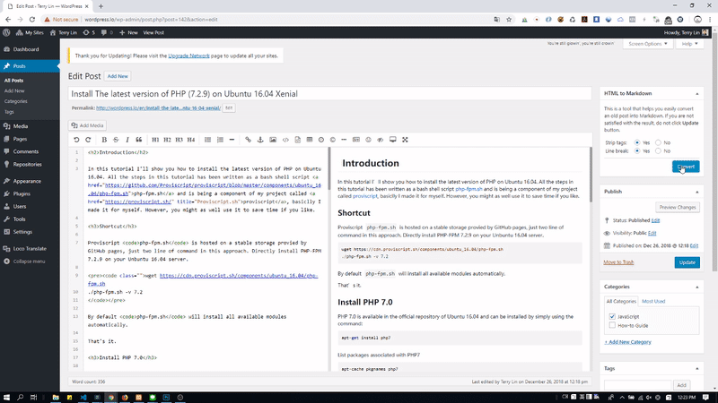

# WP Githuber MD

An all-in-on [WordPress Markdown Plugin](https://terryl.in/en/repository/wordpress-markdown-plugin-githuber-md/) provides a variety of features such as Markdown editor, live-preivew, image-paste, HTML-to-Markdown helper, and more..

## How it works

1. WP Githuber MD will save your Markdown content into `wp_posts`.`post_content_filtered`.
2. Parse the Markdown to HTML, save the parsed HTML content into `wp_posts`.`post_content`.

This plugin will detect your Markdown content and decide what scripts will be loaded, to avoid loading unnecessary scripts.
For example, if you enabled `syntax highlight`, you have to update your post again to take effects.

## Demo

### GIF animation

The demo shows you the following steps:

1. Convert HTML to Markdown by using `HTML to Markdown` tool.

2. Cut up a selection area of an image and copy it from Photoshop, then paste it to Markdown Editor.

3. Click "Update" button to save Markdown to `post_content_filtered` and save HTML to `post_content` (it is what you will see in result). 
4. View the result.

### Video

https://youtu.be/it1noNCTXa4

## Requirement

* PHP version > 5.3
* WordPress version > 4.0
* Tested up to 5.0.2

## Installation

1. Upload the plugin files to the `/wp-content/plugins/wp-githuber-md` directory, or install the plugin through the WordPress plugins screen directly.
    - Search `Githuber` through plugins screen you will find this plugin.
    - Download  from official WordPress plugin page: https://wordpress.org/plugins/wp-githuber-md/
    - Download form GitHub repository releases page: https://github.com/terrylinooo/githuber-md/releases
2. Activate the plugin through the 'Plugins' screen in WordPress.
3. Go to the `WP Githuber MD` menu in Plugins and set your Markdown options.

## Suggestions

The better situation to use this plugin is you just started a new blog.

If you're planning to use this plugin in an existing blog, be sure to:

- Turn off other Markdown plugins, because the similar plugins might do the same things when submitting your posts, may have some syntax conversion issues between Markdown and HTML.
- My personal suggestion is to turn off `revision` and `auto-save`, there are options in setting page.

## Features

* Markdown editor.
* Live preivew.
* [Image copy & paste](https://terryl.in/en/githuber-md-image-paste/).
* Syntax highlight.
* [Flow chart](https://terryl.in/en/githuber-md-flow-chart/).
* [KaTex](https://terryl.in/en/githuber-md-katax/).
* [Sequence diagram](https://terryl.in/en/githuber-md-sequence-diagrams/).
* Github flavored Markdown task list.
* Markdown extra...

### Features For Githuber Theme:

* Menu: Bootstrap 4 menu.
* Widget: Table of content.
* Post type: GitHub repository.

### Other screenshots

#### Setting pages

## Changelog

1.0.0

* First release.

1.1.0

* Add Image-Paste module.

1.2.0

* Image paste - Provide an option that allows you directly upload to Imgur.com.
* Rename plugin name from "Githuber MD" to "WP Githuber MD".
* Add new settings.

1.2.5

* Add support to WordPress 5.0 - Thanks to [Classic Editor](https://wordpress.org/plugins/classic-editor/)  plugin.

1.3.0

* Add a HTML to Markdown tool beside the editor.
* Add an option that allows users to turn off `auto-save`.
* Add more information in About page.

1.3.1

* Backward compatible with PHP 5.3 and WordPress 4.0.x. Tested OKAY.
* Modify HTML-to-Markdown helper and image-paste description.
* Add language packs for zh_TW and zh_CN.
* Improve HTML-to-Markdown helper.